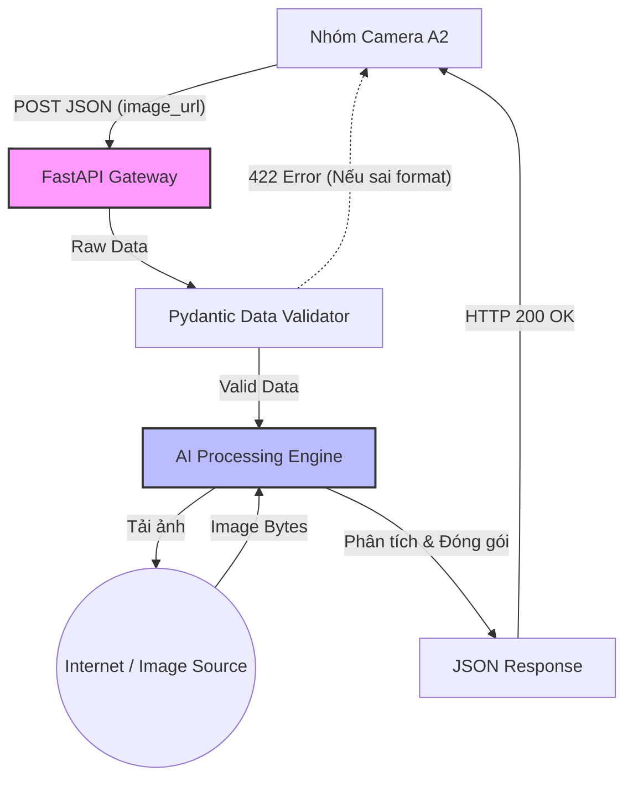

# Service Boundary: Hệ thống AI Vision (Giai đoạn MVP)

## 1. Thông tin nhóm

- Tên nhóm: Nhóm 14
- Lớp: Công nghệ thông tin 17-09
- Thành viên: Trịnh Minh Quân, Nguyễn Nhật Quang, Bùi Anh Đức, Lê Cao Tất Thành
- Service nhóm phụ trách: AI Vision Analysis Service
- Sản phẩm tổng thể của lớp: Smart Campus Operations Platform

## 2. Actor (Đối tượng tương tác)

Ai tương tác với hệ thống/service?

- **Client Services (Nhóm Camera - A2)**: Hệ thống camera gửi tín hiệu và đường dẫn ảnh để yêu cầu phân tích.
- **System Administrators**: Quản trị viên theo dõi trạng thái hệ thống qua Health Check và Swagger UI.
- **Developer/QA**: Các kỹ sư kiểm thử API contract.

## 3. System Boundary (Phạm vi Hệ thống)

Nhóm xây dựng phần nào?

Phần nhóm kiểm soát hoàn toàn (Internal):

- **API Gateway Layer**: Ứng dụng FastAPI tiếp nhận và định tuyến các HTTP request.
- **Validation Layer**: Pydantic models để kiểm tra tính hợp lệ của dữ liệu đầu vào (Data Validation).
- **AI Core Processing**: Module chạy trực tiếp mô hình AI (YOLO/OpenCV) trên server để phân tích ảnh.
- **API Documentation**: Giao diện tài liệu tương tác tự động (Swagger UI).

Phần nhóm tích hợp (External Integration):

- Nguồn cung cấp ảnh (Image Hosting/Public URLs) do phía Client (Nhóm A2) cung cấp qua payload.

## 4. Service Boundary (Trách nhiệm của Service)

Service của nhóm CÓ trách nhiệm gì?

- Cung cấp API endpoint để tiếp nhận yêu cầu phân tích ảnh thời gian thực.
- Validate định dạng dữ liệu đầu vào (bắt lỗi 422 nếu Client gửi thiếu/sai trường dữ liệu).
- Tải ảnh từ URL, đưa qua mô hình AI lõi để nhận diện vật thể/đếm người và đánh giá mức độ rủi ro (risk level).
- Đóng gói kết quả AI thành chuẩn JSON và trả về cho Client với độ trễ thấp nhất.
- Cung cấp cơ chế Health Check để các hệ thống khác biết service đang hoạt động.

Service KHÔNG làm gì?

- Không lưu trữ ảnh gốc: Ảnh chỉ được tải về bộ nhớ tạm (RAM) để xử lý, không lưu vào ổ cứng hay S3 để tối ưu chi phí và bảo mật.
- Không quản lý Database: Trong Phase 1 (MVP), kết quả trả thẳng về cho Client quyết định hành động, không lưu trữ lịch sử để đảm bảo tốc độ phản hồi.
- Không xử lý Authentication: Giả định API chạy trong mạng nội bộ (Internal Network), việc xác thực người dùng cuối sẽ do API Gateway tổng của dự án đảm nhiệm.

## 5. Input / Output

Input (Dữ liệu đầu vào)

- Phương thức: HTTP POST Request.
- Headers: Content-Type: application/json.
- Payload (JSON): Chứa các trường bắt buộc đã ký kết (API Contract):
  - `image_url`: Đường dẫn public của ảnh cần phân tích.
  - `camera_id`: Mã định danh của camera gửi request.
  - `timestamp`: Thời gian ghi nhận sự kiện (chuẩn ISO 8601).

Output (Dữ liệu đầu ra)

- Thành công (HTTP 200 OK): JSON chứa kết quả phân tích (detected, label, confidence, risk_level).
- Thất bại (HTTP 422 / 400): Standard JSON Error báo chi tiết lỗi định dạng dữ liệu từ phía Client.

## 6. API Document (Danh sách API)

| Method | Endpoint               | Mục đích                                             |
| ------ | ---------------------- | ---------------------------------------------------- |
| GET    | /                      | Sảnh chính, hiển thị trạng thái và link tới Docs     |
| GET    | /health                | Kiểm tra tình trạng sức khỏe của Service (Liveness)  |
| POST   | /api/v1/vision/analyze | Endpoint lõi: Nhận thông tin ảnh và trả kết quả AI   |
| GET    | /docs                  | Giao diện Swagger UI chuẩn OpenAPI để test trực tiếp |

## 7. Phụ thuộc service khác

Service này gọi đến đâu?

- Gọi ra Internet/Local Network để tải file ảnh từ image_url do Client cung cấp.

Service nào gọi đến service này?

- Camera Service (Nhóm A2): Gọi vào /api/v1/vision/analyze để lấy kết quả AI.
- Monitoring Tools: Gọi vào /health để giám sát thời gian thực.

## 8. Sơ đồ kiến trúc luồng dữ liệu (Data Flow)

